# MXN Market Analytics Platform 🚀

<div align="center">


</div>

## 📊 Descripción del Proyecto

MXN Market Analytics Platform es una solución de análisis predictivo para trading enfocada en el mercado mexicano, desarrollada como parte de un portafolio de Data Science & Analytics. El proyecto incorpora mejores prácticas de la industria financiera y metodologías avanzadas de análisis de datos.

### 🎯 Objetivo

Desarrollar una plataforma robusta de analytics para trading que combine:

- Análisis predictivo avanzado
- Gestión de datos financieros en tiempo real
- Machine Learning aplicado a mercados financieros
- Backtesting de estrategias cuantitativas

## 💡 Motivación

Este proyecto surge del análisis de oportunidades en Casa de Bolsa BASE y la necesidad de implementar soluciones de datos más sofisticadas en el mercado mexicano. Las principales áreas de oportunidad identificadas incluyen:

- Automatización de análisis de riesgo
- Optimización de portafolios usando ML
- Análisis predictivo para trading
- Integración de múltiples fuentes de datos

## 🛠️ Tecnologías

- Python 3.9+
- SQLite
- APIs:
  - Banxico (Datos oficiales)
  - Yahoo Finance (Datos de mercado)
  - Twitter API (Análisis de sentimiento)

## 📚 Funcionalidades

### 1. Análisis Estadístico

- Pruebas de normalidad
- Análisis de correlación
- Pruebas de estacionariedad
- Modelado de distribuciones

### 2. Machine Learning

- **Input de Datos**: 
  - **USD/MXN Fix - Banxico**: Datos de tipo de cambio oficial del Banco de México.
  - **Acciones MX - Yahoo**: Datos de acciones del mercado mexicano provenientes de Yahoo Finance.
  - **Noticias & Sentimiento**: Recopilación de noticias y análisis de sentimiento para medir la percepción del mercado.
  - **Procesamiento**: Limpieza y preparación de los datos para el análisis.

- **Feature Engineering**:
  - **Indicadores Técnicos**: Cálculo de métricas basadas en precios y volúmenes para analizar tendencias y volatilidad.
  - **Análisis Sentimiento**: Evaluación del sentimiento del mercado usando datos de noticias y redes sociales.
  - **Métricas Estadísticas**: Creación de estadísticas descriptivas, como medias y desviaciones estándar, para capturar patrones de mercado.

- **Modelo Predictivo**:
  - **LSTM Principal**: Red neuronal de memoria a corto y largo plazo (LSTM) para analizar patrones en series temporales de datos de mercado.
  - **Dense Layer**: Capa densa que combina las salidas de LSTM para mejorar la precisión de la predicción.
  - **Predicción**: Generación de la predicción final de tipo de cambio, usando las capas anteriores.

- **Output de Análisis**:
  - **Predicción USD/MXN**: Pronóstico del tipo de cambio USD/MXN a partir del modelo predictivo.
  - **Señales Trading**: Señales generadas para indicar posibles acciones de compra o venta.
  - **Métricas Riesgo**: Cálculo de indicadores de riesgo que ayudan en la toma de decisiones seguras.

```mermaid
flowchart TB
    subgraph Input["Datos Disponibles"]
        A[USD/MXN Fix - Banxico] --> D[Procesamiento]
        B[Acciones MX - Yahoo] --> D
        C[Noticias & Sentimiento] --> D
    end
    
    subgraph Features["Feature Engineering"]
        D --> E[Indicadores Técnicos]
        D --> F[Análisis Sentimiento]
        D --> G[Métricas Estadísticas]
    end
    
    subgraph Modelo["Modelo Predictivo"]
        E --> H[LSTM Principal]
        F --> H
        G --> H
        H --> I[Dense Layer]
        I --> K[Predicción]
    end
    
    subgraph Output["Análisis Final"]
        K --> L[Predicción USD/MXN]
        K --> M[Señales Trading]
        K --> N[Métricas Riesgo]
    end
```



### 3. Gestión de Datos

- Pipeline automatizado de datos
- Limpieza y validación
- Feature Engineering
- Almacenamiento optimizado

## 📂 Estructura del Proyecto

```
mxn_market_analytics/
├── notebooks/
│   ├── 01_data_collection.ipynb
│   ├── 02_exploratory_analysis.ipynb
│   ├── 03_feature_engineering.ipynb
│   ├── 04_model_development.ipynb
│   └── 05_backtesting.ipynb
├── src/
│   ├── data/
│   ├── models/
│   └── utils/
├── tests/
├── requirements.txt
└── README.md
```

## 🚀 Instalación

```bash
# Clonar el repositorio
git clone https://github.com/yourusername/mxn-market-analytics.git

# Instalar dependencias
pip install -r requirements.txt
```

## 📈 Ejemplos de Uso

```python
# Ejemplo básico de uso
from src.models import TradingStrategy
from src.data import DataCollector

# Inicializar colector de datos
collector = DataCollector()
data = collector.get_market_data()

# Crear y entrenar modelo
strategy = TradingStrategy()
strategy.train(data)
```

## 🔍 Metodología

El proyecto implementa conceptos avanzados del Diplomado en Data Science and Machine Learning applied to Financial Markets, incluyendo:

1. **Análisis Estadístico**

   - Teoría de probabilidad
   - Distribuciones estadísticas
   - Inferencia estadística

2. **Machine Learning**

   - Ensemble Learning
   - Series temporales
   - Validación de modelos

3. **Trading Algorítmico**
   - Estrategias cuantitativas
   - Análisis de mercado
   - Backtesting

## 🤝 Contribuciones

Las contribuciones son bienvenidas. Para cambios importantes, por favor abra primero un issue para discutir lo que le gustaría cambiar.

## 👨‍💻 Autor

**Gerardo Mayel Fernández**

- Data Science & Analytics Professional
- 📧 Email: geramfernandez@gmail.com
- 💼 LinkedIn: [Gerardo Mayel](https://www.linkedin.com/in/gerardomayel/)
- 🐱 GitHub: [https://github.com/GerardoMayel]

## 📝 Licencia

Este proyecto está bajo la Licencia MIT - vea el archivo [LICENSE.md](LICENSE.md) para más detalles.

## 🙏 Agradecimientos

- Casa de Bolsa BASE por proporcionar el contexto financiero, obtenido de forma libre ya que se trata de contenido público.
- ITAM por el contenido del Diplomado en Data Science and Machine Learning applied to Financial Markets en el cuál no estoy instrito pero planeo hacerlo.

---

<div align="center">
⭐️ Si este proyecto te fue útil, ¡no olvides dejar una estrella!
</div>
